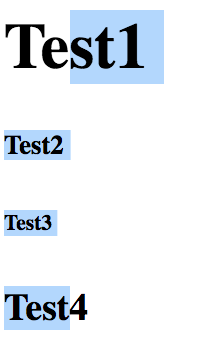

# *lish*
This repo holds the code for the Javascript library *lish*.

This library has simple functionality. In the context of  a chrome extension, *lish* allows developers to wrap selections with tags (the base case are span tags, but this can easily be changed). It also hashes the content of the selection, giving the tag a class of that hash. This task may seem trivial and is if the selection is within just one tag, but it is more difficult if the selection spans multiple tags.

### Current Status
* *lish* currently works on any set of sibling nodes that do not have children i.e.

```
<h1>Test1</h1>
<h5>Test2</h5>
<h6>Test3</h6>
<h3>Test4</h3>
```
Becomes

```
<h1>
  Te
  <span class="103495553">st1</span>
</h1>
<h5>
  <span class="103495553">Test2</span>
</h5>
<h6>
  <span class="103495553">Test3</span>
</h6>
<h3>
  <span class="103495553">Test</span>
  4
</h3>
```


 


### Goals
* As *lish* only works for a set of siblings, a goal of this project is to improve coverage. The next step is to be able to be able to highlight multiple sets of Children. If it can deal with each of the sets on their own it should not be difficult to highlight the pair. i.e.

```
<header>
  <h1>Test1</h1>
  <h5>Test2</h5>
  <h6>Test3</h6>
  <h3>Test4</h3>
</header>
<main>
  <p>Test 5</p>
  <p>Test 6</p>
</main>
```


#### Edge Case Bugs
* Coverage for Nodes that do not have elemental children but have text node children must be implemented as well. An example of this could be a p tag with an a tag in it. i.e.

```
<p> Test <a> 1 </a> </p>
```


## Getting Started

* There are more files in this repository than those that need to be downloaded for *lish* to be used. The only file that you need to use the functionality is [selection.js](lib/selection.js) in the lib folder.
* Implement the file into your extentsion by making it a content script in your Manifest.Json. Fire the function 'getSelectionData' through a context menu to use the library.
* This repository is also an example of how to implement selection.js. Look through the code in the extension folder if you need help with Chrome Extensions. All of the code is well commented so it should help you getting started.


## Contributing

* Any type of contribution is welcome, and if you are interested in adding this project please address an issue and see the contributing guidelines, [CONTRIBUTING.md](CONTRIBUTING.md).

## Code of Conduct

* Please contribute respectfully on this project—anything else will not be tolerated. For more information, see [CODE_OF_CONDUCT.md](CODE_OF_CONDUCT.md).

## License

* This project uses the MIT license. See the [LICENSE](LICENSE) for more information.


## Fun Facts

* The name *lish* comes from the last name of the famous literary editor Gordon Lish. As he was a literary editor, and this project has to do with editing the DOM, and the fact that he went to the same high-school I did, I named it after him.

## Authors

* **M. Malcolm Essaid** (malcolmessaid1@gmail.com)
